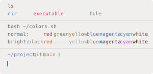
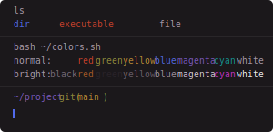
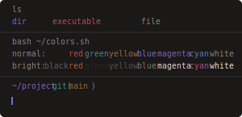
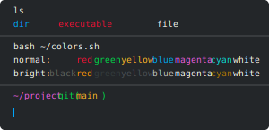
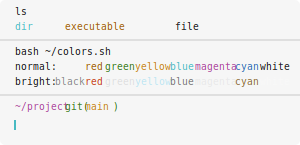

# Base16 Warp Themes

| Theme name                                                                       | Preview                                                                     |
| -------------------------------------------------------------------------------- | --------------------------------------------------------------------------- |
| **[Base16 3024](base16_3024.yaml)**:                                             |                        |
| **[Base16 Apathy](base16_apathy.yaml)**:                                         |                      |
| **[Base16 Apprentice](base16_apprentice.yaml)**:                                 |                  |
| **[Base16 Asam](base16_asam.yaml)**:                                             |                        |
| **[Base16 Ashes](base16_ashes.yaml)**:                                           |                       |
| **[Base16 Atelier Cave](base16_atelier_cave.yaml)**:                             |                |
| **[Base16 Atelier Cave Light](base16_atelier_cave_light.yaml)**:                 |          |
| **[Base16 Atelier Dune](base16_atelier_dune.yaml)**:                             |                |
| **[Base16 Atelier Dune Light](base16_atelier_dune_light.yaml)**:                 |          |
| **[Base16 Atelier Estuary](base16_atelier_estuary.yaml)**:                       |             |
| **[Base16 Atelier Estuary Light](base16_atelier_estuary_light.yaml)**:           |       |
| **[Base16 Atelier Forest](base16_atelier_forest.yaml)**:                         |              |
| **[Base16 Atelier Forest Light](base16_atelier_forest_light.yaml)**:             |        |
| **[Base16 Atelier Heath](base16_atelier_heath.yaml)**:                           |               |
| **[Base16 Atelier Heath Light](base16_atelier_heath_light.yaml)**:               |         |
| **[Base16 Atelier Lakeside](base16_atelier_lakeside.yaml)**:                     |            |
| **[Base16 Atelier Lakeside Light](base16_atelier_lakeside_light.yaml)**:         |      |
| **[Base16 Atelier Plateau](base16_atelier_plateau.yaml)**:                       |             |
| **[Base16 Atelier Plateau Light](base16_atelier_plateau_light.yaml)**:           |       |
| **[Base16 Atelier Savanna](base16_atelier_savanna.yaml)**:                       |             |
| **[Base16 Atelier Savanna Light](base16_atelier_savanna_light.yaml)**:           |       |
| **[Base16 Atelier Seaside](base16_atelier_seaside.yaml)**:                       |             |
| **[Base16 Atelier Seaside Light](base16_atelier_seaside_light.yaml)**:           |       |
| **[Base16 Atelier Sulphurpool](base16_atelier_sulphurpool.yaml)**:               |         |
| **[Base16 Atelier Sulphurpool Light](base16_atelier_sulphurpool_light.yaml)**:   |   |
| **[Base16 Atlas](base16_atlas.yaml)**:                                           |                       |
| **[Base16 Bespin](base16_bespin.yaml)**:                                         |                      |
| **[Base16 Black Metal](base16_black_metal.yaml)**:                               |                 |
| **[Base16 Black Metal Bathory](base16_black_metal_bathory.yaml)**:               |         |
| **[Base16 Black Metal Burzum](base16_black_metal_burzum.yaml)**:                 |          |
| **[Base16 Black Metal Dark Funeral](base16_black_metal_dark_funeral.yaml)**:     |    |
| **[Base16 Black Metal Gorgoroth](base16_black_metal_gorgoroth.yaml)**:           |       |
| **[Base16 Black Metal Immortal](base16_black_metal_immortal.yaml)**:             |        |
| **[Base16 Black Metal Khold](base16_black_metal_khold.yaml)**:                   |           |
| **[Base16 Black Metal Marduk](base16_black_metal_marduk.yaml)**:                 |          |
| **[Base16 Black Metal Mayhem](base16_black_metal_mayhem.yaml)**:                 |          |
| **[Base16 Black Metal Nile](base16_black_metal_nile.yaml)**:                     |            |
| **[Base16 Black Metal Venom](base16_black_metal_venom.yaml)**:                   |           |
| **[Base16 Brewer](base16_brewer.yaml)**:                                         |                      |
| **[Base16 Bright](base16_bright.yaml)**:                                         |                      |
| **[Base16 Brogrammer](base16_brogrammer.yaml)**:                                 |                  |
| **[Base16 Brushtrees](base16_brushtrees.yaml)**:                                 |                  |
| **[Base16 Brushtrees Dark](base16_brushtrees_dark.yaml)**:                       |             |
| **[Base16 Chalk](base16_chalk.yaml)**:                                           |                       |
| **[Base16 Circus](base16_circus.yaml)**:                                         |                      |
| **[Base16 Classic Dark](base16_classic_dark.yaml)**:                             |                |
| **[Base16 Classic Light](base16_classic_light.yaml)**:                           |               |
| **[Base16 Codeschool](base16_codeschool.yaml)**:                                 |                  |
| **[Base16 Cupcake](base16_cupcake.yaml)**:                                       |                     |
| **[Base16 Cupertino](base16_cupertino.yaml)**:                                   |                   |
| **[Base16 Danqing](base16_danqing.yaml)**:                                       |                     |
| **[Base16 Darcula](base16_darcula.yaml)**:                                       |                     |
| **[Base16 Darkmoss](base16_darkmoss.yaml)**:                                     |                    |
| **[Base16 Darktooth](base16_darktooth.yaml)**:                                   |                   |
| **[Base16 Darkviolet](base16_darkviolet.yaml)**:                                 |                  |
| **[Base16 Decaf](base16_decaf.yaml)**:                                           |                       |
| **[Base16 Default Dark](base16_default_dark.yaml)**:                             |                |
| **[Base16 Default Light](base16_default_light.yaml)**:                           |               |
| **[Base16 Dirtysea](base16_dirtysea.yaml)**:                                     |                    |
| **[Base16 Dracula](base16_dracula.yaml)**:                                       |                     |
| **[Base16 Edge Dark](base16_edge_dark.yaml)**:                                   |                   |
| **[Base16 Edge Light](base16_edge_light.yaml)**:                                 |                  |
| **[Base16 Eighties](base16_eighties.yaml)**:                                     |                    |
| **[Base16 Embers](base16_embers.yaml)**:                                         |                      |
| **[Base16 Equilibrium Dark](base16_equilibrium_dark.yaml)**:                     |            |
| **[Base16 Equilibrium Gray Dark](base16_equilibrium_gray_dark.yaml)**:           |       |
| **[Base16 Equilibrium Gray Light](base16_equilibrium_gray_light.yaml)**:         |      |
| **[Base16 Equilibrium Light](base16_equilibrium_light.yaml)**:                   |           |
| **[Base16 Espresso](base16_espresso.yaml)**:                                     |                    |
| **[Base16 Eva](base16_eva.yaml)**:                                               |                         |
| **[Base16 Eva Dim](base16_eva_dim.yaml)**:                                       |                     |
| **[Base16 Flat](base16_flat.yaml)**:                                             |                        |
| **[Base16 Framer](base16_framer.yaml)**:                                         |                      |
| **[Base16 Fruit Soda](base16_fruit_soda.yaml)**:                                 |                  |
| **[Base16 Gigavolt](base16_gigavolt.yaml)**:                                     |                    |
| **[Base16 Github](base16_github.yaml)**:                                         |                      |
| **[Base16 Google Dark](base16_google_dark.yaml)**:                               |                 |
| **[Base16 Google Light](base16_google_light.yaml)**:                             |                |
| **[Base16 Grayscale Dark](base16_grayscale_dark.yaml)**:                         |              |
| **[Base16 Grayscale Light](base16_grayscale_light.yaml)**:                       |             |
| **[Base16 Greenscreen](base16_greenscreen.yaml)**:                               |                 |
| **[Base16 Gruvbox Dark Hard](base16_gruvbox_dark_hard.yaml)**:                   |           |
| **[Base16 Gruvbox Dark Medium](base16_gruvbox_dark_medium.yaml)**:               |         |
| **[Base16 Gruvbox Dark Pale](base16_gruvbox_dark_pale.yaml)**:                   |           |
| **[Base16 Gruvbox Dark Soft](base16_gruvbox_dark_soft.yaml)**:                   |           |
| **[Base16 Gruvbox Light Hard](base16_gruvbox_light_hard.yaml)**:                 |          |
| **[Base16 Gruvbox Light Medium](base16_gruvbox_light_medium.yaml)**:             |        |
| **[Base16 Gruvbox Light Soft](base16_gruvbox_light_soft.yaml)**:                 |          |
| **[Base16 Hardcore](base16_hardcore.yaml)**:                                     |                    |
| **[Base16 Harmonic Dark](base16_harmonic_dark.yaml)**:                           |               |
| **[Base16 Harmonic Light](base16_harmonic_light.yaml)**:                         |              |
| **[Base16 Heetch](base16_heetch.yaml)**:                                         |                      |
| **[Base16 Heetch Light](base16_heetch_light.yaml)**:                             |                |
| **[Base16 Helios](base16_helios.yaml)**:                                         |                      |
| **[Base16 Hopscotch](base16_hopscotch.yaml)**:                                   |                   |
| **[Base16 Horizon Dark](base16_horizon_dark.yaml)**:                             |                |
| **[Base16 Horizon Light](base16_horizon_light.yaml)**:                           |               |
| **[Base16 Horizon Terminal Dark](base16_horizon_terminal_dark.yaml)**:           |       |
| **[Base16 Horizon Terminal Light](base16_horizon_terminal_light.yaml)**:         |      |
| **[Base16 Humanoid Dark](base16_humanoid_dark.yaml)**:                           |               |
| **[Base16 Humanoid Light](base16_humanoid_light.yaml)**:                         |              |
| **[Base16 Ia Dark](base16_ia_dark.yaml)**:                                       |                     |
| **[Base16 Ia Light](base16_ia_light.yaml)**:                                     |                    |
| **[Base16 Icy](base16_icy.yaml)**:                                               |                         |
| **[Base16 Irblack](base16_irblack.yaml)**:                                       |                     |
| **[Base16 Isotope](base16_isotope.yaml)**:                                       |                     |
| **[Base16 Kimber](base16_kimber.yaml)**:                                         |                      |
| **[Base16 Macintosh](base16_macintosh.yaml)**:                                   |                   |
| **[Base16 Marrakesh](base16_marrakesh.yaml)**:                                   |                   |
| **[Base16 Materia](base16_materia.yaml)**:                                       |                     |
| **[Base16 Material](base16_material.yaml)**:                                     |                    |
| **[Base16 Material Darker](base16_material_darker.yaml)**:                       |             |
| **[Base16 Material Lighter](base16_material_lighter.yaml)**:                     |            |
| **[Base16 Material Palenight](base16_material_palenight.yaml)**:                 |          |
| **[Base16 Material Vivid](base16_material_vivid.yaml)**:                         |              |
| **[Base16 Mellow Purple](base16_mellow_purple.yaml)**:                           |               |
| **[Base16 Mexico Light](base16_mexico_light.yaml)**:                             |                |
| **[Base16 Mocha](base16_mocha.yaml)**:                                           |                       |
| **[Base16 Monokai](base16_monokai.yaml)**:                                       |                     |
| **[Base16 Nebula](base16_nebula.yaml)**:                                         |                      |
| **[Base16 Nord](base16_nord.yaml)**:                                             |                        |
| **[Base16 Nova](base16_nova.yaml)**:                                             |                        |
| **[Base16 Ocean](base16_ocean.yaml)**:                                           |                       |
| **[Base16 Oceanicnext](base16_oceanicnext.yaml)**:                               |                 |
| **[Base16 One Light](base16_one_light.yaml)**:                                   |                   |
| **[Base16 Onedark](base16_onedark.yaml)**:                                       |                     |
| **[Base16 Outrun Dark](base16_outrun_dark.yaml)**:                               |                 |
| **[Base16 Papercolor Dark](base16_papercolor_dark.yaml)**:                       |             |
| **[Base16 Papercolor Light](base16_papercolor_light.yaml)**:                     |            |
| **[Base16 Paraiso](base16_paraiso.yaml)**:                                       |                     |
| **[Base16 Pasque](base16_pasque.yaml)**:                                         |                      |
| **[Base16 Phd](base16_phd.yaml)**:                                               |                         |
| **[Base16 Pico](base16_pico.yaml)**:                                             |                        |
| **[Base16 Pop](base16_pop.yaml)**:                                               |                         |
| **[Base16 Porple](base16_porple.yaml)**:                                         |                      |
| **[Base16 Railscasts](base16_railscasts.yaml)**:                                 |                  |
| **[Base16 Rebecca](base16_rebecca.yaml)**:                                       |                     |
| **[Base16 Rose Pine](base16_rose_pine.yaml)**:                                   |                   |
| **[Base16 Rose Pine Dawn](base16_rose_pine_dawn.yaml)**:                         |              |
| **[Base16 Rose Pine Moon](base16_rose_pine_moon.yaml)**:                         |              |
| **[Base16 Sagelight](base16_sagelight.yaml)**:                                   |                   |
| **[Base16 Sandcastle](base16_sandcastle.yaml)**:                                 |                  |
| **[Base16 Seti](base16_seti.yaml)**:                                             |                        |
| **[Base16 Shapeshifter](base16_shapeshifter.yaml)**:                             |                |
| **[Base16 Silk Dark](base16_silk_dark.yaml)**:                                   |                   |
| **[Base16 Silk Light](base16_silk_light.yaml)**:                                 |                  |
| **[Base16 Snazzy](base16_snazzy.yaml)**:                                         |                      |
| **[Base16 Solarflare](base16_solarflare.yaml)**:                                 |                  |
| **[Base16 Solarflare Light](base16_solarflare_light.yaml)**:                     |            |
| **[Base16 Solarized Dark](base16_solarized_dark.yaml)**:                         |              |
| **[Base16 Solarized Light](base16_solarized_light.yaml)**:                       |             |
| **[Base16 Spacemacs](base16_spacemacs.yaml)**:                                   |                   |
| **[Base16 Summercamp](base16_summercamp.yaml)**:                                 |                  |
| **[Base16 Summerfruit Dark](base16_summerfruit_dark.yaml)**:                     |            |
| **[Base16 Summerfruit Light](base16_summerfruit_light.yaml)**:                   |           |
| **[Base16 Synth Midnight Dark](base16_synth_midnight_dark.yaml)**:               |         |
| **[Base16 Synth Midnight Light](base16_synth_midnight_light.yaml)**:             |        |
| **[Base16 Tango](base16_tango.yaml)**:                                           |                       |
| **[Base16 Tender](base16_tender.yaml)**:                                         |                      |
| **[Base16 Tomorrow](base16_tomorrow.yaml)**:                                     |                    |
| **[Base16 Tomorrow Night](base16_tomorrow_night.yaml)**:                         |              |
| **[Base16 Tomorrow Night Eighties](base16_tomorrow_night_eighties.yaml)**:       |     |
| **[Base16 Tube](base16_tube.yaml)**:                                             |                        |
| **[Base16 Twilight](base16_twilight.yaml)**:                                     |                    |
| **[Base16 Unikitty Dark](base16_unikitty_dark.yaml)**:                           |               |
| **[Base16 Unikitty Light](base16_unikitty_light.yaml)**:                         |              |
| **[Base16 Vulcan](base16_vulcan.yaml)**:                                         |                      |
| **[Base16 Windows 10](base16_windows_10.yaml)**:                                 |                  |
| **[Base16 Windows 10 Light](base16_windows_10_light.yaml)**:                     |            |
| **[Base16 Windows 95](base16_windows_95.yaml)**:                                 |                  |
| **[Base16 Windows 95 Light](base16_windows_95_light.yaml)**:                     |            |
| **[Base16 Windows Highcontrast](base16_windows_highcontrast.yaml)**:             |        |
| **[Base16 Windows Highcontrast Light](base16_windows_highcontrast_light.yaml)**: |  |
| **[Base16 Windows Nt](base16_windows_nt.yaml)**:                                 |                  |
| **[Base16 Windows Nt Light](base16_windows_nt_light.yaml)**:                     |            |
| **[Base16 Woodland](base16_woodland.yaml)**:                                     |                    |
| **[Base16 Xcode Dusk](base16_xcode_dusk.yaml)**:                                 |                  |
| **[Base16 Zenburn](base16_zenburn.yaml)**:                                       |                     |
