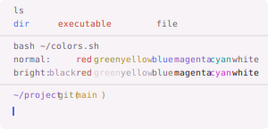
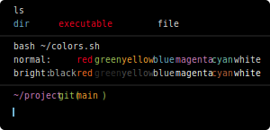
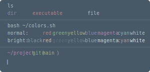
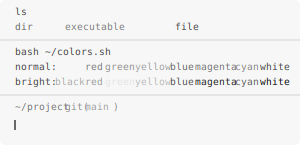
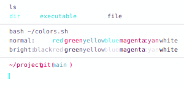
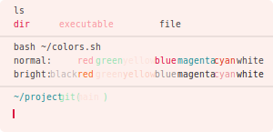
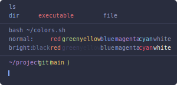
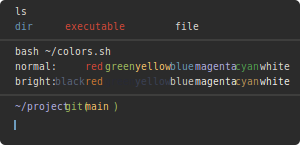
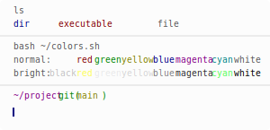

## What are base16 themes?
> An architecture for building themes based on carefully chosen syntax highlighting using a base of sixteen colors. Base16 provides a set of guidelines detailing how to style syntax and how to code a builder for compiling Base16 schemes and templates.

More on the details and structure here: https://github.com/chriskempson/base16.

## Acknowledgements
Themes in this directory were sourced and auto-generated based on the Alacritty themes collected by @aarowill.
Repo: https://github.com/aarowill/base16-alacritty

|Theme name | Preview|
| --- | --- |
|**Base16 3024**:||
|**Base16 Apathy**:||
|**Base16 Apprentice**:||
|**Base16 Ashes**:||
|**Base16 Atelier Cave**:||
|**Base16 Atelier Cave Light**:||
|**Base16 Atelier Dune**:||
|**Base16 Atelier Dune Light**:||
|**Base16 Atelier Estuary**:||
|**Base16 Atelier Estuary Light**:||
|**Base16 Atelier Forest**:||
|**Base16 Atelier Forest Light**:||
|**Base16 Atelier Heath**:||
|**Base16 Atelier Heath Light**:||
|**Base16 Atelier Lakeside**:||
|**Base16 Atelier Lakeside Light**:||
|**Base16 Atelier Plateau**:||
|**Base16 Atelier Plateau Light**:||
|**Base16 Atelier Savanna**:||
|**Base16 Atelier Savanna Light**:||
|**Base16 Atelier Seaside**:||
|**Base16 Atelier Seaside Light**:||
|**Base16 Atelier Sulphurpool**:||
|**Base16 Atelier Sulphurpool Light**:||
|**Base16 Atlas**:||
|**Base16 Bespin**:||
|**Base16 Black Metal**:||
|**Base16 Black Metal Bathory**:||
|**Base16 Black Metal Burzum**:||
|**Base16 Black Metal Dark Funeral**:||
|**Base16 Black Metal Gorgoroth**:||
|**Base16 Black Metal Immortal**:||
|**Base16 Black Metal Khold**:||
|**Base16 Black Metal Marduk**:||
|**Base16 Black Metal Mayhem**:||
|**Base16 Black Metal Nile**:||
|**Base16 Black Metal Venom**:||
|**Base16 Brewer**:||
|**Base16 Bright**:||
|**Base16 Brogrammer**:||
|**Base16 Brushtrees**:||
|**Base16 Brushtrees Dark**:||
|**Base16 Chalk**:||
|**Base16 Circus**:||
|**Base16 Classic Dark**:||
|**Base16 Classic Light**:||
|**Base16 Codeschool**:||
|**Base16 Cupcake**:||
|**Base16 Cupertino**:||
|**Base16 Danqing**:||
|**Base16 Darcula**:||
|**Base16 Darkmoss**:||
|**Base16 Darktooth**:||
|**Base16 Darkviolet**:||
|**Base16 Decaf**:||
|**Base16 Default Dark**:||
|**Base16 Default Light**:||
|**Base16 Dirtysea**:||
|**Base16 Dracula**:||
|**Base16 Edge Dark**:||
|**Base16 Edge Light**:||
|**Base16 Eighties**:||
|**Base16 Embers**:||
|**Base16 Equilibrium Dark**:||
|**Base16 Equilibrium Gray Dark**:||
|**Base16 Equilibrium Gray Light**:||
|**Base16 Equilibrium Light**:||
|**Base16 Espresso**:||
|**Base16 Eva**:||
|**Base16 Eva Dim**:||
|**Base16 Flat**:||
|**Base16 Framer**:||
|**Base16 Fruit Soda**:||
|**Base16 Gigavolt**:||
|**Base16 Github**:||
|**Base16 Google Dark**:||
|**Base16 Google Light**:||
|**Base16 Grayscale Dark**:||
|**Base16 Grayscale Light**:||
|**Base16 Greenscreen**:||
|**Base16 Gruvbox Dark Hard**:||
|**Base16 Gruvbox Dark Medium**:||
|**Base16 Gruvbox Dark Pale**:||
|**Base16 Gruvbox Dark Soft**:||
|**Base16 Gruvbox Light Hard**:||
|**Base16 Gruvbox Light Medium**:||
|**Base16 Gruvbox Light Soft**:||
|**Base16 Hardcore**:||
|**Base16 Harmonic Dark**:||
|**Base16 Harmonic Light**:||
|**Base16 Heetch**:||
|**Base16 Heetch Light**:||
|**Base16 Helios**:||
|**Base16 Hopscotch**:||
|**Base16 Horizon Dark**:||
|**Base16 Horizon Light**:||
|**Base16 Horizon Terminal Dark**:||
|**Base16 Horizon Terminal Light**:||
|**Base16 Humanoid Dark**:||
|**Base16 Humanoid Light**:||
|**Base16 Ia Dark**:||
|**Base16 Ia Light**:||
|**Base16 Icy**:||
|**Base16 Irblack**:||
|**Base16 Isotope**:||
|**Base16 Kimber**:||
|**Base16 Macintosh**:||
|**Base16 Marrakesh**:||
|**Base16 Materia**:||
|**Base16 Material**:||
|**Base16 Material Darker**:||
|**Base16 Material Lighter**:||
|**Base16 Material Palenight**:||
|**Base16 Material Vivid**:||
|**Base16 Mellow Purple**:||
|**Base16 Mexico Light**:||
|**Base16 Mocha**:||
|**Base16 Monokai**:||
|**Base16 Nebula**:||
|**Base16 Nord**:||
|**Base16 Nova**:||
|**Base16 Ocean**:||
|**Base16 Oceanicnext**:||
|**Base16 One Light**:||
|**Base16 Onedark**:||
|**Base16 Outrun Dark**:||
|**Base16 Papercolor Dark**:||
|**Base16 Papercolor Light**:||
|**Base16 Paraiso**:||
|**Base16 Pasque**:||
|**Base16 Phd**:||
|**Base16 Pico**:||
|**Base16 Pop**:||
|**Base16 Porple**:||
|**Base16 Railscasts**:||
|**Base16 Rebecca**:||
|**Base16 Rose Pine**:||
|**Base16 Rose Pine Dawn**:||
|**Base16 Rose Pine Moon**:||
|**Base16 Sagelight**:||
|**Base16 Sandcastle**:||
|**Base16 Seti**:||
|**Base16 Shapeshifter**:||
|**Base16 Silk Dark**:||
|**Base16 Silk Light**:||
|**Base16 Snazzy**:||
|**Base16 Solarflare**:||
|**Base16 Solarflare Light**:||
|**Base16 Solarized Dark**:||
|**Base16 Solarized Light**:||
|**Base16 Spacemacs**:||
|**Base16 Summercamp**:||
|**Base16 Summerfruit Dark**:||
|**Base16 Summerfruit Light**:||
|**Base16 Synth Midnight Dark**:||
|**Base16 Synth Midnight Light**:||
|**Base16 Tango**:||
|**Base16 Tender**:||
|**Base16 Tomorrow**:||
|**Base16 Tomorrow Night**:||
|**Base16 Tomorrow Night Eighties**:||
|**Base16 Tube**:||
|**Base16 Twilight**:||
|**Base16 Unikitty Dark**:||
|**Base16 Unikitty Light**:||
|**Base16 Vulcan**:||
|**Base16 Windows 10**:||
|**Base16 Windows 10 Light**:||
|**Base16 Windows 95**:||
|**Base16 Windows 95 Light**:||
|**Base16 Windows Highcontrast**:||
|**Base16 Windows Highcontrast Light**:||
|**Base16 Windows Nt**:||
|**Base16 Windows Nt Light**:||
|**Base16 Woodland**:||
|**Base16 Xcode Dusk**:||
|**Base16 Zenburn**:||