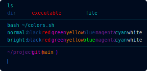

# Warp Themes

This is an open source repository with themes for [Warp](https://www.warp.dev/).
We welcome and appreciate any contributions!

We have [directions on how to use this repository in our documentation.](https://docs.warp.dev/features/themes)

[Discord](https://discord.gg/warpdotdev)

[Warp Repo](https://github.com/warpdotdev/Warp)

## Open source dependencies

We'd like to call out a few of the open source themes and repositories that helped bootstrap the set of themes for Warp:

- [iTerm colors pencil](https://github.com/mattly/iterm-colors-pencil)
- [Alacritty-theme](https://github.com/eendroroy/alacritty-theme)
- [base16-Alacritty](https://github.com/aarowill/base16-alacritty)
- [base16](https://github.com/chriskempson/base16)
- [Solarized](https://ethanschoonover.com/solarized/)
- [Dracula](https://draculatheme.com/)
- [Gruvbox](https://github.com/morhetz/gruvbox)

## What are base16 themes?

> An architecture for building themes based on carefully chosen syntax highlighting using a base of sixteen colors. Base16 provides a set of guidelines detailing how to style syntax and how to code a builder for compiling Base16 schemes and templates.

More on the details and structure here: [https://github.com/chriskempson/base16.](https://github.com/chriskempson/base16)

Base16 themes were sourced and auto-generated based on the Alacritty themes collected by @aarowill.
Repo: [https://github.com/aarowill/base16-alacritty](https://github.com/aarowill/base16-alacritty)

## What are standard themes?

In this directory you'll find themes popular among other tools, including Solarized, Dracula and others.

Themes in this directory were sourced and auto-generated based on the Alacritty themes collected by @eendroroy.
Repo: [https://github.com/eendroroy/alacritty-theme](https://github.com/eendroroy/alacritty-theme)

## What are holiday themes?

 We made holiday themes to celebrate various holidays during the calendar year.

The [Thanksgiving Theme](https://twitter.com/warpdotdev/status/1463663176680157190?s=20) used [this background](https://unsplash.com/photos/ZwPuquZBnyM) taken by [
Yannick Pulver](https://unsplash.com/@yanu).

The [Winter Holiday Theme](https://twitter.com/warpdotdev/status/1474159550961840130?s=20&t=G8CKtGzU6kda5R3_gH9t4A) used [this background](https://unsplash.com/photos/TD8CbG9-sMk) taken by [Jeremy Kovac](https://unsplash.com/@jkovac).
|Theme name | Preview|
| --- | --- |
|**[Afterglow](afterglow.yaml)**:||
|**[Argonaut](argonaut.yaml)**:||
|**[Avirage](avirage.yaml)**:||
|**[Ayu Dark](ayu_dark.yaml)**:||
|**[Blood Moon](blood_moon.yaml)**:||
|**[Breeze](breeze.yaml)**:||
|**[Campbell](campbell.yaml)**:||
|**[Catppuccin](catppuccin.yaml)**:||
|**[Challenger Deep](challenger_deep.yaml)**:||
|**[Cobalt 2](cobalt_2.yaml)**:||
|**[Cobalt Next](cobalt_next.yaml)**:||
|**[Cyber Punk Neon](cyber_punk_neon.yaml)**:||
|**[Darcula](darcula.yaml)**:||
|**[Dark Pastels](dark_pastels.yaml)**:||
|**[Default Dark](default_dark.yaml)**:||
|**[Dracula](dracula.yaml)**:||
|**[Everforest Hard](everforest_hard.yaml)**:||
|**[Everforest Light](everforest_light.yaml)**:||
|**[Fairyfloss](fairyfloss.yaml)**:||
|**[Faithful Argonaut](faithful_argonaut.yaml)**:||
|**[Falcon](falcon.yaml)**:||
|**[Flat Remix](flat_remix.yaml)**:||
|**[Github Dark](github_dark.yaml)**:||
|**[Github Dark Dimmed](github_dark_dimmed.yaml)**:||
|**[Github Light](github_light.yaml)**:||
|**[Gotham](gotham.yaml)**:||
|**[Green Geeko](green_geeko.yaml)**:||
|**[Gruvbox Dark](gruvbox_dark.yaml)**:||
|**[Gruvbox Light](gruvbox_light.yaml)**:||
|**[Gruvbox Material](gruvbox_material.yaml)**:||
|**[High Contrast](high_contrast.yaml)**:||
|**[Horizon Dark](horizon_dark.yaml)**:||
|**[Hyper](hyper.yaml)**:||
|**[Iceberg](iceberg.yaml)**:||
|**[Iterm](iterm.yaml)**:||
|**[Jellybeans](jellybeans.yaml)**:||
|**[Konsole Linux](konsole_linux.yaml)**:||
|**[Low Contrast](low_contrast.yaml)**:||
|**[Lucario](lucario.yaml)**:||
|**[Material Theme](material_theme.yaml)**:||
|**[Material Theme Mod](material_theme_mod.yaml)**:||
|**[Monokai Pro](monokai_pro.yaml)**:||
|**[Monokai Pro Classic](monokai_pro_classic.yaml)**:||
|**[Monokai Pro Machine](monokai_pro_machine.yaml)**:||
|**[Monokai Pro Octagon](monokai_pro_octagon.yml)**:||
|**[Monokai Pro Ristretto](monokai_pro_ristretto.yml)**:||
|**[Monokai Pro Spectrum](monokai_pro_spectrum.yml)**:||
|**[Night Owl](night_owl.yaml)**:||
|**[Nord](nord.yaml)**:||
|**[Oceanic Next](oceanic_next.yaml)**:||
|**[Omni](omni.yaml)**:||
|**[One Dark](one_dark.yaml)**:||
|**[Palenight](palenight.yaml)**:||
|**[Papercolor Light](papercolor_light.yaml)**:||
|**[Pencil Dark](pencil_dark.yaml)**:||
|**[Pencil Light](pencil_light.yaml)**:||
|**[Remedy Dark](remedy_dark.yaml)**:||
|**[Seashells](seashells.yaml)**:||
|**[Simply Dark](simply_dark.yaml)**:||
|**[Snazzy](snazzy.yaml)**:||
|**[Solarized Dark](solarized_dark.yaml)**:||
|**[Solarized Light](solarized_light.yaml)**:||
|**[Taerminal](taerminal.yaml)**:||
|**[Tango Dark](tango_dark.yaml)**:||
|**[Tender](tender.yaml)**:||
|**[Terminal App](terminal_app.yaml)**:||
|**[Thelovelace](thelovelace.yaml)**:||
|**[Tokyo Night](tokyo_night.yaml)**:||
|**[Tokyo Night Storm](tokyo_night_storm.yaml)**:||
|**[Tomorrow Night](tomorrow_night.yaml)**:||
|**[Tomorrow Night Bright](tomorrow_night_bright.yaml)**:||
|**[Wombat](wombat.yaml)**:||
|**[Xterm](xterm.yaml)**:||