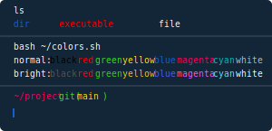
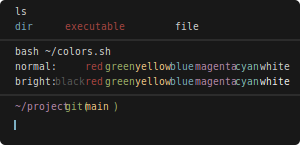

In this directory you'll find themes popular among other tools, including Solarized, Dracula and others.

Themes in this directory were sourced and auto-generated based on the Alacritty themes collected by @eendroroy.
Repo: https://github.com/eendroroy/alacritty-theme
|Theme name | Preview|
| --- | --- |
|**Omni**:||
|**Gruvbox Dark**:||
|**Remedy Dark**:||
|**Tomorrow Night Bright**:||
|**Darcula**:||
|**Tokyo Night**:||
|**Argonaut**:||
|**Taerminal**:||
|**Palenight**:||
|**Iterm**:||
|**Tender**:||
|**Thelovelace**:||
|**Solarized Light**:||
|**Tango Dark**:||
|**Campbell**:||
|**Flat Remix**:||
|**Falcon**:||
|**Material Theme Mod**:||
|**Gruvbox Light**:||
|**Oceanic Next**:||
|**Nord**:||
|**High Contrast**:||
|**Pencil Light**:||
|**Blood Moon**:||
|**Material Theme**:||
|**Dracula**:||
|**Breeze**:||
|**Ayu Dark**:||
|**Cobalt2**:||
|**Wombat**:||
|**Challenger Deep**:||
|**Terminal App**:||
|**Tomorrow Night**:||
|**Gruvbox Material**:||
|**Seashells**:||
|**Solarized Dark**:||
|**Konsole Linux**:||
|**Tokyo Night Storm**:||
|**Cyber Punk Neon**:||
|**Base16 Default Dark**:||
|**Gotham**:||
|**Horizon Dark**:||
|**Papercolor Light**:||
|**Xterm**:||
|**Hyper**:||
|**Afterglow**:||
|**Snazzy**:||
|**Pencil Dark**:||
|**Low Contrast**:||
|**One Dark**:||
|**Dark Pastels**:||