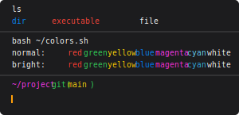
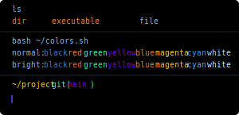
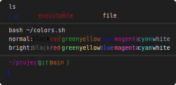
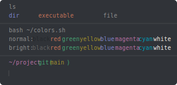
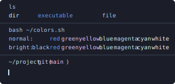
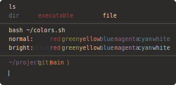
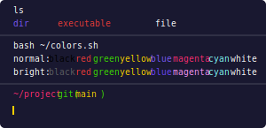
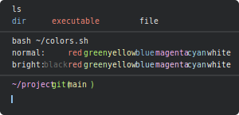

|Theme name | Preview|
| --- | --- |
|**[Afterglow](afterglow.yaml)**:||
|**[Apple Dark](apple_dark.yaml)**:||
|**[Apple Light](apple_light.yaml)**:||
|**[Arc Dark](arc_dark.yaml)**:||
|**[Argonaut](argonaut.yaml)**:||
|**[Avirage](avirage.yaml)**:||
|**[Ayu Dark](ayu_dark.yaml)**:||
|**[Ayu Light](ayu_light.yaml)**:||
|**[Ayu Mirage](ayu_mirage.yaml)**:||
|**[Azuki](azuki.yaml)**:||
|**[Bilibili Dark](bilibili_dark.yaml)**:||
|**[Blood Moon](blood_moon.yaml)**:||
|**[Blue Monday](blue_monday.yaml)**:||
|**[Breeze](breeze.yaml)**:||
|**[Campbell](campbell.yaml)**:||
|**[Catppuccin](catppuccin.yaml)**:||
|**[Challenger Deep](challenger_deep.yaml)**:||
|**[Cherry](cherry.yaml)**:||
|**[Classic Vivid](classic_vivid.yaml)**:||
|**[Cobalt 2](cobalt_2.yaml)**:||
|**[Cobalt Next](cobalt_next.yaml)**:||
|**[Cyberpunk-2077](cyberpunk-2077.yaml)**:||
|**[Cyberpunk-neon](cyberpunk-neon.yaml)**:||
|**[Cyberpunk-night City](cyberpunk-night_city.yaml)**:||
|**[Cyberpunk-v](cyberpunk-v.yaml)**:||
|**[Daobeam](daobeam.yaml)**:||
|**[Darcula](darcula.yaml)**:||
|**[Dark-pinkish](dark-pinkish.yaml)**:||
|**[Dark Pastels](dark_pastels.yaml)**:||
|**[Deep Ocean](deep_ocean.yaml)**:||
|**[Default Dark](default_dark.yaml)**:||
|**[Dracula](dracula.yaml)**:||
|**[Edgerunners-david](edgerunners-david.yaml)**:||
|**[Edgerunners-lucy And David Jump](edgerunners-lucy_and_david_jump.yaml)**:||
|**[Everforest Hard](everforest_hard.yaml)**:||
|**[Everforest Light](everforest_light.yaml)**:||
|**[Fairyfloss](fairyfloss.yaml)**:||
|**[Faithful Argonaut](faithful_argonaut.yaml)**:||
|**[Falcon](falcon.yaml)**:||
|**[Flat Remix](flat_remix.yaml)**:||
|**[Github Dark](github_dark.yaml)**:||
|**[Github Dark Dimmed](github_dark_dimmed.yaml)**:||
|**[Github Light](github_light.yaml)**:||
|**[Gotham](gotham.yaml)**:||
|**[Green Geeko](green_geeko.yaml)**:||
|**[Gruvbox Dark](gruvbox_dark.yaml)**:||
|**[Gruvbox Light](gruvbox_light.yaml)**:||
|**[Gruvbox Material](gruvbox_material.yaml)**:||
|**[Hackthebox](hackthebox.yaml)**:||
|**[Halcyon](halcyon.yaml)**:||
|**[High Contrast](high_contrast.yaml)**:||
|**[Horizon Dark](horizon_dark.yaml)**:||
|**[Hyper](hyper.yaml)**:||
|**[Iceberg](iceberg.yaml)**:||
|**[Iterm](iterm.yaml)**:||
|**[Jellybeans](jellybeans.yaml)**:||
|**[Konsole Linux](konsole_linux.yaml)**:||
|**[Laser](laser.yaml)**:||
|**[Light-pinkish](light-pinkish.yaml)**:||
|**[Low Contrast](low_contrast.yaml)**:||
|**[Lucario](lucario.yaml)**:||
|**[Material Theme](material_theme.yaml)**:||
|**[Material Theme Mod](material_theme_mod.yaml)**:||
|**[Matrix Dracula](matrix_dracula.yaml)**:||
|**[Matrix Dracula Switcheroo](matrix_dracula_switcheroo.yaml)**:||
|**[Monokai Pro](monokai_pro.yaml)**:||
|**[Monokai Pro Classic](monokai_pro_classic.yaml)**:||
|**[Monokai Pro Machine](monokai_pro_machine.yaml)**:||
|**[Monokai Pro Octagon](monokai_pro_octagon.yml)**:||
|**[Monokai Pro Ristretto](monokai_pro_ristretto.yml)**:||
|**[Monokai Pro Spectrum](monokai_pro_spectrum.yml)**:||
|**[Night Owl](night_owl.yaml)**:||
|**[Nightfly](nightfly.yaml)**:||
|**[Nord](nord.yaml)**:||
|**[Oceanic Next](oceanic_next.yaml)**:||
|**[Omni](omni.yaml)**:||
|**[One Dark](one_dark.yaml)**:||
|**[One Monokai](one_monokai.yaml)**:||
|**[Outrun](outrun.yaml)**:||
|**[Palenight](palenight.yaml)**:||
|**[Panda Syntax](panda_syntax.yaml)**:||
|**[Papercolor Light](papercolor_light.yaml)**:||
|**[Pencil Dark](pencil_dark.yaml)**:||
|**[Pencil Light](pencil_light.yaml)**:||
|**[Penumbra Dark](penumbra_dark.yaml)**:||
|**[Penumbra Light](penumbra_light.yaml)**:||
|**[Plastic](plastic.yaml)**:||
|**[Poimandres](poimandres.yaml)**:||
|**[Poimandres Alt](poimandres_alt.yaml)**:||
|**[Remedy Dark](remedy_dark.yaml)**:||
|**[Seashells](seashells.yaml)**:||
|**[Shades Of Purple](shades_of_purple.yaml)**:||
|**[Shades Of Purple Super Dark](shades_of_purple_super_dark.yaml)**:||
|**[Simply Dark](simply_dark.yaml)**:||
|**[Snazzy](snazzy.yaml)**:||
|**[Snazzy Blue](snazzy_blue.yaml)**:||
|**[Snazzy Green](snazzy_green.yaml)**:||
|**[Snazzy Red](snazzy_red.yaml)**:||
|**[Soft One Dark](soft_one_dark.yaml)**:||
|**[Solarized Dark](solarized_dark.yaml)**:||
|**[Solarized Light](solarized_light.yaml)**:||
|**[Spaceduck](spaceduck.yaml)**:||
|**[Synthwave 84](synthwave_84.yaml)**:||
|**[Taerminal](taerminal.yaml)**:||
|**[Tango Dark](tango_dark.yaml)**:||
|**[Tender](tender.yaml)**:||
|**[Terminal App](terminal_app.yaml)**:||
|**[Thelovelace](thelovelace.yaml)**:||
|**[Tokyo Night](tokyo_night.yaml)**:||
|**[Tokyo Night Storm](tokyo_night_storm.yaml)**:||
|**[Tomorrow Night](tomorrow_night.yaml)**:||
|**[Tomorrow Night Bright](tomorrow_night_bright.yaml)**:||
|**[Vitesse Black](vitesse_black.yaml)**:||
|**[Vitesse Dark](vitesse_dark.yaml)**:||
|**[Vitesse Dark Soft](vitesse_dark_soft.yaml)**:||
|**[Vitesse Light](vitesse_light.yaml)**:||
|**[Vitesse Light Soft](vitesse_light_soft.yaml)**:||
|**[Vscode Default Dark Material](vscode_default_dark_material.yml)**:||
|**[Vuesion](vuesion.yaml)**:||
|**[Wombat](wombat.yaml)**:||
|**[Xterm](xterm.yaml)**:||
|**[Zenbones Dark](zenbones_dark.yaml)**:||
|**[Zenbones Light](zenbones_light.yaml)**:||