# Bundled Warp Themes

| Theme name                                   | Preview                                                   |
| -------------------------------------------- | --------------------------------------------------------- |
| **[Cyber Wave](cyber_wave.yaml)**:           | 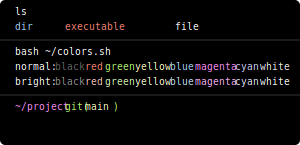      |
| **[Dark City](dark_city.yaml)**:             | 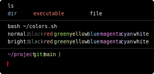       |
| **[Dracula](dracula.yaml)**:                 | 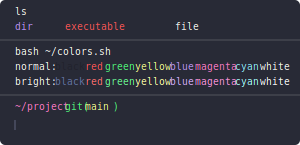         |
| **[Fancy Dracula](fancy_dracula.yaml)**:     | 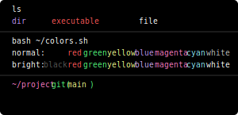   |
| **[Gruvbox Dark](gruvbox_dark.yaml)**:       | 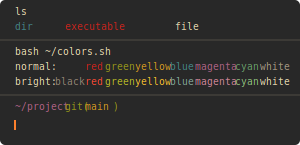    |
| **[Gruvbox Light](gruvbox_light.yaml)**:     | 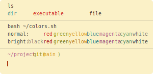   |
| **[Jellyfish](jellyfish.yaml)**:             | 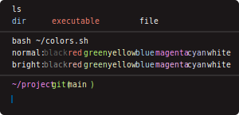       |
| **[Koi](koi.yaml)**:                         | 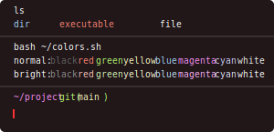             |
| **[Leafy](leafy.yaml)**:                     | 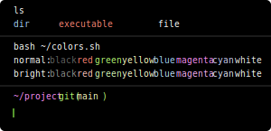           |
| **[Marble](marble.yaml)**:                   | 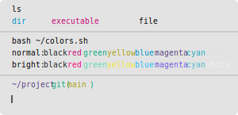          |
| **[Pink City](pink_city.yaml)**:             | 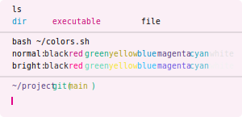       |
| **[Red Rock](red_rock.yaml)**:               | 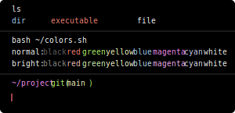        |
| **[Snowy](snowy.yaml)**:                     |            |
| **[Solarized Dark](solarized_dark.yaml)**:   |   |
| **[Solarized Light](solarized_light.yaml)**: | 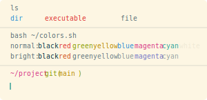 |
| **[Warp](warp.yaml)**:                       |             |
| **[Warp Dark](warp_dark.yaml)**:             | 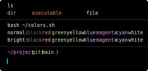       |
| **[Warp Light](warp_light.yaml)**:           | 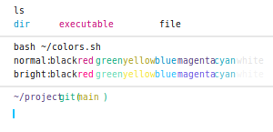      |
| **[Willow Dream](willow_dream.yaml)**:       |     |
